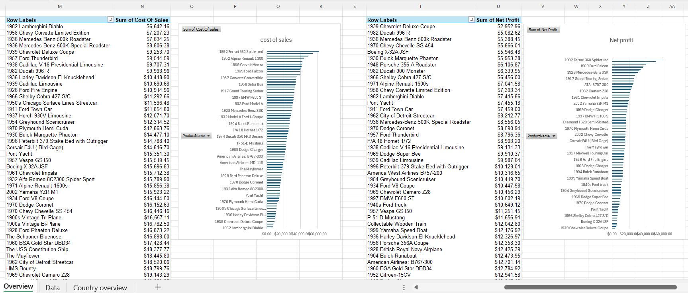
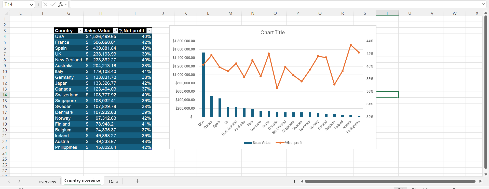
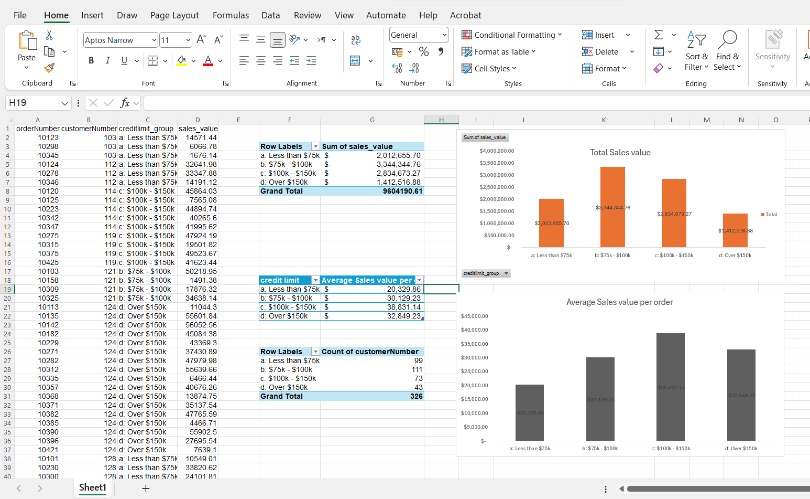
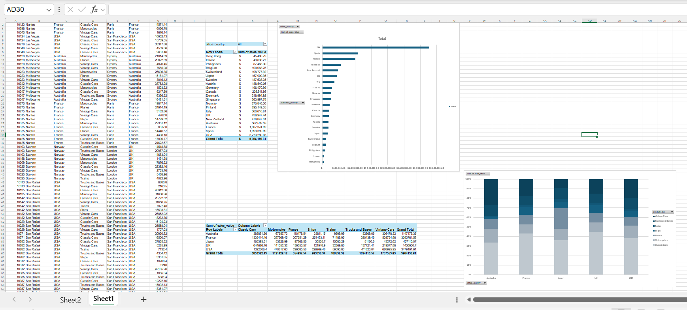

# Classic Models | Sales Analysis with SQL & Excel

A collection of business-case analyses using the **Classic Models** sales database. Each case starts with a business request, is answered using a **MySQL query**, and the results are then summarized and analyzed in **Excel**.

The project demonstrates how to translate business questions into SQL analysis and turn query results into clear, business-oriented insights.

- **Dataset:** [Classic Models on Kaggle](https://www.kaggle.com/datasets/pushkar365/classic-models)
- **Related project:** [Classic Models Sales Dashboard — Power BI](https://github.com/11-hadeel/Classic-Model-Dashboard-Power-Bi)

> **Acknowledgment:** The business questions are based on exercises from a Udemy data analysis course.
---

## Project Overview

The goal of this project is to analyze sales data from different business perspectives, including:

- Product and geographic sales performance
- Products frequently purchased together
- Credit limit and customer sales behavior
- Changes in customer spending between orders
- Office performance by customer country
- Potential shipping delays
- Customer balances compared with credit limits

The analysis follows a simple workflow:

**Business Question → SQL Query → Data Analysis → Excel Summary → Business Insight**

---

## Business Questions

| # | Business Request | SQL Techniques | Output |
|---|---|---|---|
| 1 | **2004 Sales Overview:** Analyze sales by product, country, and city, including sales value, cost of sales, and net profit. | Joins, Aggregation | SQL · Excel |
| 2 | **Products Purchased Together:** Identify product lines that are commonly or rarely purchased in the same order. | CTE, Self Join | SQL · Excel |
| 3 | **Sales by Credit Limit:** Group customers by credit limit to examine whether higher credit limits are associated with higher sales. | CTE, `CASE` | SQL · Excel |
| 4 | **Change from Previous Order:** Compare each customer's sales with their previous purchase to analyze changes in spending over time. | CTEs, `LAG()`, `ROW_NUMBER()` | SQL · Excel |
| 5 | **Office Sales by Customer Country:** Identify where the customers served by each office are located. | CTE, Multi-table Joins | SQL · Excel |
| 6 | **Late Shipping:** Identify orders that may be affected by shipping delays of up to three days. | `DATE_ADD()`, `CASE` | SQL |
| 7 | **Money Owed vs. Credit Limit:** Calculate customer sales and running balances to identify customers who exceeded their credit limits. | CTEs, `LEAD()`, `SUM() OVER` | SQL |

---


## Tools & Skills

### MySQL

- Multi-table joins
- Self joins
- Common Table Expressions (CTEs)
- Window functions:
  - `LAG()`
  - `LEAD()`
  - `ROW_NUMBER()`
  - `SUM() OVER`
- `CASE` expressions
- Date functions
- Aggregation and business-oriented calculations

### Excel

- PivotTables
- Data summaries
- Business-focused analysis
- Visualization of SQL query results

### Data Analysis

- Translating business requests into analytical questions
- Writing SQL queries to answer business questions
- Interpreting query results
- Summarizing findings for business users
- Connecting technical analysis with business decisions

---

## Repository Structure

```text
├── README.md
├── SQL/
│   ├── 01_sales_overview_product.sql
│   ├── 02_products_purchased_together.sql
│   ├── 03_sales_value_by_credit_limit.sql
│   ├── 04_difference_from_previous_sale.sql
│   ├── 05_office_sales_by_customer_country.sql
│   ├── 06_late_shipping.sql
│   └── 07_over_credit_limit.sql
├── EXCEL/
│   ├── 01_sales_overview_product.xlsx
│   ├── 02_products_purchased_together.xlsx
│   ├── 03_sales_value_by_credit_limit.xlsx
│   ├── 04_difference_from_previous_sale.xlsx
│   └── 05_office_sales_by_customer_country.xlsx
└── images/
```

---

## Project Screenshots

### Sales Overview


### Sales Overview - Detailed View


### Credit Limit vs. Sales


### Office Sales by Customer Country


---

## How to Use

1. Download the **Classic Models** dataset from Kaggle.
2. Import the dataset into MySQL using the database name `classicmodels`.
3. Open the required SQL script from the `SQL/` folder.
4. Run the query in MySQL.
5. Open the corresponding Excel workbook from the `EXCEL/` folder.
6. Review the summarized results and business analysis.

---

## Related Project

The SQL and Excel analysis is complemented by an interactive Power BI dashboard:

**[Classic Models Sales Dashboard — Power BI](https://github.com/11-hadeel/Classic-Model-Dashboard-Power-Bi)**

---

## Author

**Hadeel Taqi**

Information Systems Engineering | Data Analytics

**Skills:** SQL · Excel · Power BI  · Data Analysis

[LinkedIn](https://www.linkedin.com/in/hadeel-taqi-26baba267/) · [GitHub](https://github.com/11-hadeel)
